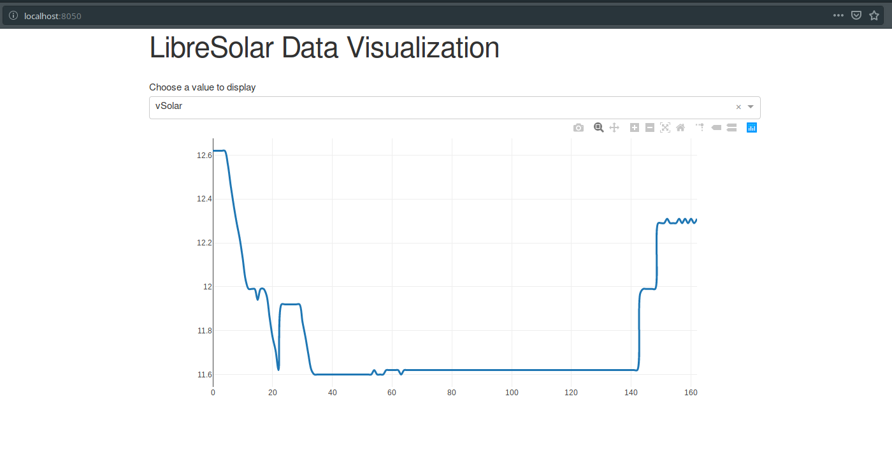

# ThingSet Dashboard
This application is an interface and visualization tool for the libreSolar box. It listens on a given serial interface for incoming data using the ThingSet protocol and stores the data in a local sqlite database. A web app provides an interface to view measurement data and change settings on the microcontrollers of the box.

ThingSet publication messages are valid JSON maps with a `#` prefix as indicator, like the following simple example:
```
# {"vBat": 15.2, "tAmbient": 22}
```
There is also a more compact binary version (CBOR format) which shall be supportet in a later step.

# Usage

Install Python and necessary libraries:

    pip install -r requirements.txt

Collect data:

    python sqlite_worker.py path/to/database.db

Show and analyze collected data:

    python app.py path/to/database.db

Convert collected data to CSV file:

    sqlite3 -header -csv path/to/database.db "SELECT * FROM ThingSet;" > path/to/database.csv

# Current Status

Line plots from sqlite database working

