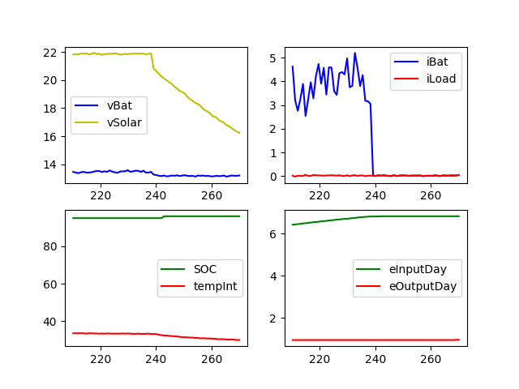

# ThingSet Plotter

Python tool to plot ThingSet publication message data received via serial interface. Future implementations will also support CAN interface.

ThingSet publication messages are valid JSON maps with a `#` prefix as indicator, like the following simple example:

```
# {"vBat": 15.2, "tAmbient": 22}
```

There is also a more compact binary version (CBOR format) which shall be supportet in a later step.

## Development Roadmap

1. Command-line interface where different data objects can be assigned to a specific plot. Also the serial interface should be configurable.

2. GUI where all received data objects are shown and can be selected via check boxes and assigned to different plots (possibly using wxPython)

3. GUI which allows to use full ThingSet function set, including configuration of device parameters (bi-directional communication instead of data monitoring only)

## Currrent Status

First proof of concept working. Following graph using python animation package is generated (data objects still hard-coded):



## Useage

Install Python and necessary libraries:
```
pip install matplotlib serial json datetime numpy
```

Call the plotter:
```
python3 thingset_csv_monitor.py > data.csv
```

Above command will show the live window and log the received data as .csv file in `data.csv`.